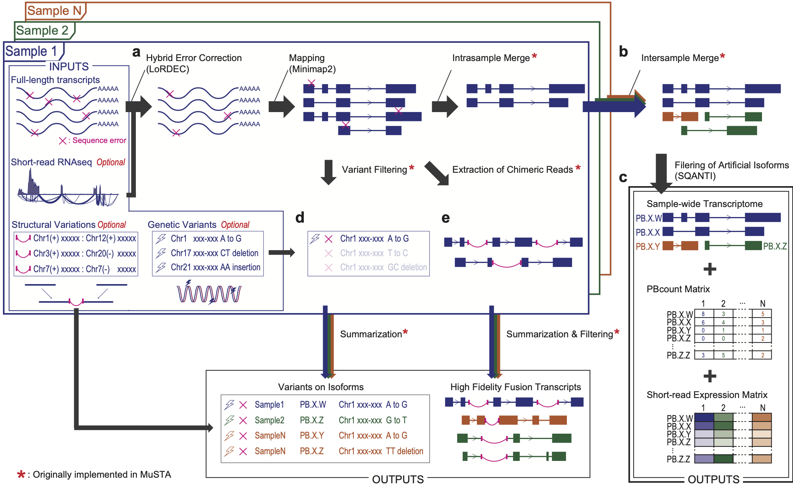

.. role:: red

=====================
MuSTA
=====================

MuSTA (Multi-Sample Transcriptome Assembly) is a pipeline for genarating an assembled transcriptome from multi-sample results of long-read transcript sequencing technologies.

By merging IsoSeq reads which were considered to be derived from one transcript, MuSTA provides a catalog of non-redundant transcripts according to each sample, and subsequently merge them in all samples.
This procedure is followed by `SQANTI <https://github.com/ConesaLab/SQANTI>`_ filtering, which removes potential artifact transcripts by a random forest algorithm, eventually creating cohort-wide transcriptome.

MuSTA enables the comparison of the number of uniquely associated full-length non-chimeric reads, which we refer as PBcount, between samples. In addition, alignment of short-reads to the created transcriptome enables the estimation of gene expression just as conventional analyses, and to compare group wide expression such as differential gene expression (DGE) and DTU in your downstream analysis.

It was originally developed and optimized for IsoSeq cluster or polished reads (Pacific Biosciences), but its libraries can be individually applied for other long-read sequencing like Oxford Nanopore Technologies.

For further information, please see `our article <https://doi.org/10.1101/2020.07.15.199851>`_.

Arguments
=========

Usage is written in `another section <usage.html>`_.

Outputs
=======

result
------

All the results of MuSTA will be located in the 'result' directory.

<PREFIX> [.fa, .gtf]
    An assembled transcriptome.

<PREFIX>.pbcount.txt
    A PBcount matrix.
    PBcount is defined as the number of uniquely associated full-length non-chimeric (FLNC) reads.

<PREFIX>.existence.txt
    A TRUE/FALSE matrix.
    TRUE means an isoform was detected in a particular sample, and vise versa.

<PREFIX>.correlation.txt
    Correlation between the assembled isoform, intra-sample merged reads, and original reads.
    
    **gene_id**, **transcript_id**: gene/transcript IDs of the assembled isoform.
    
    **sample**: sample names.
    
    **g_id_sample**, **tx_id_sample**: gene/transcript IDs of the intra-sample merged reads.
    
    **seq_id**: IDs of original reads.
    
    **type**, **intra_type**, **inter_type**: the type of correlation. One of `intronic_match_include`, `include`, and `monoex_match`.

.. note::
    Both `intronic_match_include` and `include` mean that the range of the query transcript is included in that of the assembled transcript.
    
    The difference is that all of the splicing junctions are identical in `intronic_match_include`, whereas `include` indicates that 5’ truncated multi-exon isoforms are combined with longer and compatible isoforms.
    
    As for single-exon transcripts, MuSTA consolidates reads with other single-exon transcripts if genomic range of the former transcript was overlapped with the latter read (`monoex`).

<PREFIX>.salmon [.count.txt, .tpm.txt]
    An expression matrix derived from short-read RNAseq data.

original_range.multiex.txt
    The start/end locus of original reads (1-based in genomic coordinates).

sqanti_classification.txt, sqanti_junctions.txt, sqanti_report.pdf
    SQANTI reports for the assembled transcriptome.

report
------

IO.summary.csv
    A comma-separated file containing a list of paths to intermediate files. 
    One column represents one sample.

plan_pre_run.pdf
    An image representing the MuSTA workflow you specified, which is generated *before* running it.

plan_post_run.pdf
    An image representing the MuSTA workflow, which is generated *after* running it.

.. note::
    All of the workflow should be completed if you find `report/plan_post_run.pdf` in your output directory.
    It is recommended to additionally check whether the information in `report/plan_post_run.pdf` is up-to-date.

.. note::
    All the other intermediate files except for some important ones (written with an :red:`asterisk` below) will be removed unless you activate `--keep` option.
    The format of intermediate files without an :red:`asterisk` might be changed in the future updates.

script
------

Shell scripts for subprocesses.

log
---

Log files for subprocesses will be wirtten in this directory only if MuSTA is executed in the HPC mode.

samples
-------

This directory contains sub-directories for all samples.

<SAMPLE_NAME>/hq.lordec [.fa :red:`*`, .paf, .sam]
    A LoRDEC-corrected fasta file and paf/sam files which are generated by mapping it with `minimap2 <https://github.com/lh3/minimap2>`_ .
    The paf file format is defined at `minimap2 website <https://github.com/lh3/minimap2#paftools>`_ .

<SAMPLE_NAME>/hq.lordec.qfilt [.paf :red:`*`, .sam :red:`*`, .sort.bam :red:`*`]
    Quality-filtered files with your specified mapping-quality threshold.

<SAMPLE_NAME>/lordec.qfilt.fusion.txt :red:`*`
    A file with chimeric reads (i.e. reads mapped to multiple regions).

<SAMPLE_NAME>/intra_merge [.gtf :red:`*`, .correlation.txt :red:`*`], <SAMPLE_NAME>/variant.txt :red:`*`
    Outputs of intra-sample merge.

<SAMPLE_NAME>/[salmon_pre_sqanti, salmon_post_sqanti :red:`*`]
    Output directories corresponding to two executions of `salmon <https://salmon.readthedocs.io>`_ .
    *salmon_pre_sqanti* files are prepared for `SQANTI <https://github.com/ConesaLab/SQANTI>`_ qualty-control and filtering.
    SQANTI removes artificial reads by a random-forest algorithm.
    After SQANTI filtering, MuSTA re-runs salmon with the non-artificial transcriptome, and its results are stored at the *salmon_post_sqanti* directory.
    If you need to use salmon's *quant.sf* files instead of summarised file in the *result* directory, you should use ones in the *salmon_post_sqanti* directory, **NOT** ones in the *salmon_pre_sqanti* directory.

merge
-----

This folder contains intermediate results for the inter-sample merged transcripts.

inter_merge [.fa, .gtf] :red:`*`
    An assembled transcriptome which does not go through SQANTI filtering (and can contain artifacts).

initial_sqanti_* :red:`*`
    SQANTI results for inter_merge.gtf.

salmon_init [.count.txt, .tpm.txt]
    An expression matrix calculated by mapping short-read RNAseq data to inter_merge.fa.

GMST :red:`*`
    The results of GeneMark-ST, which is called by SQANTI.

RTS :red:`*`
    RT-switching prediction by SQANTI.

fusion
------

Summary files for chimeric reads will be put in this directory.

genome
------

BSgenome.<REF_GENOME>.user.<OUTPUT>
    An R package built from the provided reference fasta.

<REF_GENOME>.mmi
    An mmi file for minimap2.

=====================
Citation
=====================

If you feel this pipeline (or related codes) is useful, please cite:

S Namba *et al*. Multi-sample Full-length Transcriptome Analysis of 22 Breast Cancer Clinical Specimens with Long-Read Sequencing. ***BioRxiv*** (2020) https://doi.org/10.1101/2020.07.15.199851
