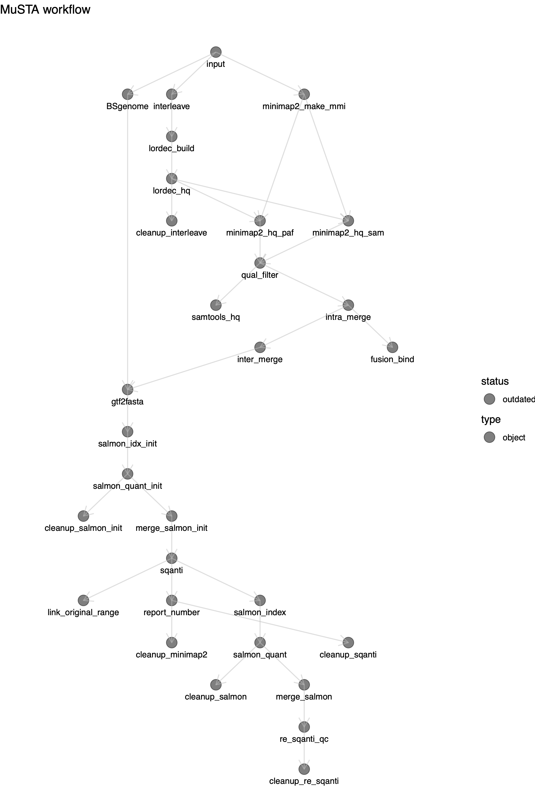
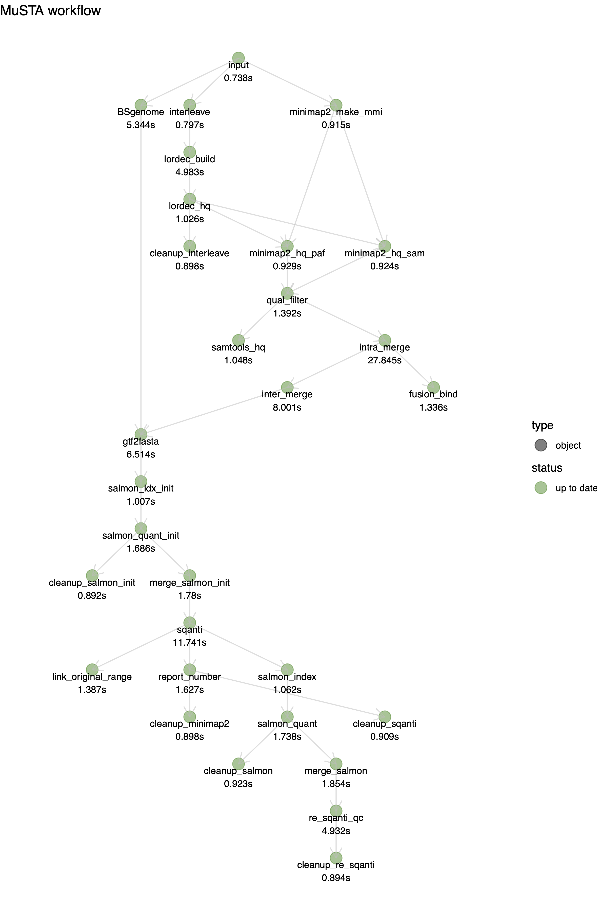

Tutorial
========

Check the version
-----------------

``` bash
./MuSTA.R -v
```

    #> 0.0.1

Dry-run
-------

In order to check your config file before actually processing it, the
`--dry-run` option is useful.

``` bash
./MuSTA.R \
  --dry-run \
  --input test/input.csv \
  --gtf test/reference/test.ref.gtf \
  --genome test/reference/chr16_18_head.fa
```

This command returns 4 types of information.

1.  Valid arguments

2.  Session information

3.  Paths to intermediate files to be generated.

4.  The generated workflow based on the options

In addition, you can find ‘plan\_pre\_run.pdf’ in your working
directory, which visualizes the generated workflow.



Test run
--------

You can apply MuSTA to a test data by

``` bash
./MuSTA.R \
  --input test/input.csv \
  --gtf test/reference/test.ref.gtf \
  --genome test/reference/chr16_18_head.fa \
  --output test/test_output
```

This command creates a directory named ‘test/test\_output’ containing 8
sub-directories

    output:
        result
        report
        script
        log
        sample
        merge
        fusion
        genome

By checking ‘report/plan\_post\_run.pdf’, you can find that all
procedures have been done.



All of the important outputs can be found in the ‘result’ directory. The
main outputs have the prefix supplied by the `--prefix` option (in this
tutorial, the prefix is ‘musta’).

``` r
# The assembled transcriptome
## fasta
print(Biostrings::readDNAStringSet("test/test_output/result/musta.fa"))
```

    #>   A DNAStringSet instance of length 8
    #>     width seq                                          names               
    #> [1]   571 TGGAGGAAAGATGAGTGAGAG...GAAAACAGGGGAATCCCGAA PB.1.1
    #> [2]  1652 CTTGCCGTCAGCCTTTTCTTT...AAGCACACTGTTGGTTTCTG PB.1.2
    #> [3]   248 CCTTTGGTTCTGCCATTGCTG...GAAAACAGGGGAATCCCGAA PB.1.3
    #> [4]   920 CTTAGGGAACAAGCATTAAAC...TGAATTGATGTTTTCCTGCT PB.2.1
    #> [5]   699 AGGGGCGCGCAGCGCCGGCGC...TTTTTGGAGATTTCTGTCTT PB.2.2
    #> [6]  1800 AACTGAGGTCACCAGTCCCCA...GAGTGTCAGTTTAATGCTTG PB.3.1
    #> [7]   567 GTAACACACAATACAGACTTC...ATATAAAAGATAGAAATCTC PB.4.1
    #> [8]   207 AGAGCCTAGAAAATATCACCT...AAATACGCAAAATAAAGAGC PB.4.2

``` r
## gtf
knitr::kable(as.data.frame(rtracklayer::import("test/test_output/result/musta.gtf")))
```

| seqnames |  start|    end|  width| strand | source | type |  score|  phase| gene\_id | transcript\_id |
|:---------|------:|------:|------:|:-------|:-------|:-----|------:|------:|:---------|:---------------|
| 18       |  11200|  12999|   1800| \-     | NA     | exon |     NA|     NA| PB.3     | PB.3.1         |
| 16       |  11861|  11908|     48| \+     | NA     | exon |     NA|     NA| PB.1     | PB.1.1         |
| 16       |  12294|  12378|     85| \+     | NA     | exon |     NA|     NA| PB.1     | PB.1.1         |
| 16       |  12663|  12733|     71| \+     | NA     | exon |     NA|     NA| PB.1     | PB.1.1         |
| 16       |  12906|  13073|    168| \+     | NA     | exon |     NA|     NA| PB.1     | PB.1.1         |
| 16       |  13153|  13351|    199| \+     | NA     | exon |     NA|     NA| PB.1     | PB.1.1         |
| 16       |  11555|  11908|    354| \+     | NA     | exon |     NA|     NA| PB.1     | PB.1.2         |
| 16       |  12294|  12402|    109| \+     | NA     | exon |     NA|     NA| PB.1     | PB.1.2         |
| 16       |  12902|  14090|   1189| \+     | NA     | exon |     NA|     NA| PB.1     | PB.1.2         |
| 16       |  13025|  13073|     49| \+     | NA     | exon |     NA|     NA| PB.1     | PB.1.3         |
| 16       |  13153|  13351|    199| \+     | NA     | exon |     NA|     NA| PB.1     | PB.1.3         |
| 18       |  14195|  14653|    459| \-     | NA     | exon |     NA|     NA| PB.4     | PB.4.1         |
| 18       |  14851|  14958|    108| \-     | NA     | exon |     NA|     NA| PB.4     | PB.4.1         |
| 18       |  14490|  14653|    164| \-     | NA     | exon |     NA|     NA| PB.4     | PB.4.2         |
| 18       |  16856|  16898|     43| \-     | NA     | exon |     NA|     NA| PB.4     | PB.4.2         |
| 18       |  11191|  11595|    405| \+     | NA     | exon |     NA|     NA| PB.2     | PB.2.1         |
| 18       |  13152|  13354|    203| \+     | NA     | exon |     NA|     NA| PB.2     | PB.2.1         |
| 18       |  15617|  15928|    312| \+     | NA     | exon |     NA|     NA| PB.2     | PB.2.1         |
| 18       |  11103|  11595|    493| \+     | NA     | exon |     NA|     NA| PB.2     | PB.2.2         |
| 18       |  15617|  15822|    206| \+     | NA     | exon |     NA|     NA| PB.2     | PB.2.2         |

``` r
## PBcount: the number of uniquely associated full-length non-chimeric (FLNC) reads
knitr::kable(readr::read_tsv("test/test_output/result/musta.pbcount.txt", col_types = readr::cols(.default = readr::col_character())))
```

| gene\_id | transcript\_id | sample1 | sample2 | sample3 | sample4 |
|:---------|:---------------|:--------|:--------|:--------|:--------|
| PB.1     | PB.1.1         | 1       | 0       | 0       | 0       |
| PB.1     | PB.1.2         | 2       | 2       | 4       | 2       |
| PB.1     | PB.1.3         | 0       | 0       | 0       | 1       |
| PB.2     | PB.2.1         | 3       | 2       | 0       | 3       |
| PB.2     | PB.2.2         | 1       | 0       | 2       | 0       |
| PB.3     | PB.3.1         | 3       | 4       | 4       | 4       |
| PB.4     | PB.4.1         | 1       | 3       | 0       | 0       |
| PB.4     | PB.4.2         | 1       | 0       | 0       | 0       |

``` r
## (Short-read) expression: Transcript-per-Million (TPM) calclated by salmon
knitr::kable(read.table("test/test_output/result/musta.salmon.tpm.txt", header = TRUE, sep = "\t"))
```

|        |       sample1|      sample2|       sample3|       sample4|
|--------|-------------:|------------:|-------------:|-------------:|
| PB.1.1 |  1.511232e+04|   44382.6210|   88062.37451|  1.472174e+04|
| PB.1.2 |  3.120952e+01|     127.4420|      21.76253|  1.540468e+01|
| PB.1.3 |  0.000000e+00|       0.0000|       0.00000|  0.000000e+00|
| PB.2.1 |  4.213970e-01|    2571.9971|      17.17896|  4.783747e+00|
| PB.2.2 |  1.798816e+04|   13003.6101|    8130.36359|  2.941479e+04|
| PB.3.1 |  6.512953e+04|     482.1847|  394043.41935|  5.035502e+01|
| PB.4.1 |  1.461157e+00|   44382.6210|     221.16281|  1.472174e+04|
| PB.4.2 |  9.017369e+05|  895049.5241|  509503.73825|  9.410712e+05|

You can conduct downstream analyses to investigate differentially
expressed gene, differential transcript usage and so on. Most of the
popular packages such as {DESeq2}, {DEXSeq}, and {SUPPA2} are available
by setting the assembled transcriptome as reference. Some users might
find [tappas](https://app.tappas.org/) is useful for these purposes if
they would like to conduct a number of analyses on GUI. The
transcriptome can be imported to tappas with the aid of
[IsoAnnotLite](https://isoannot.tappas.org/isoannot-lite/).
